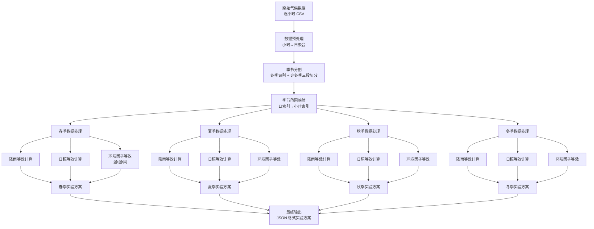
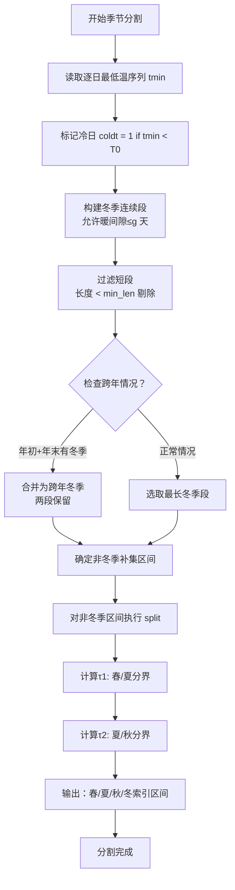
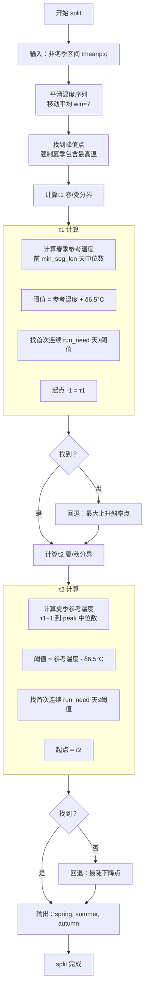
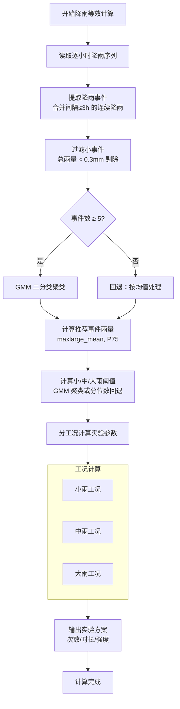
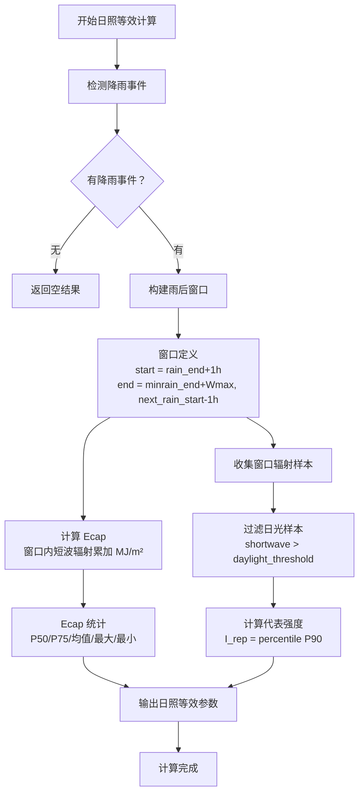
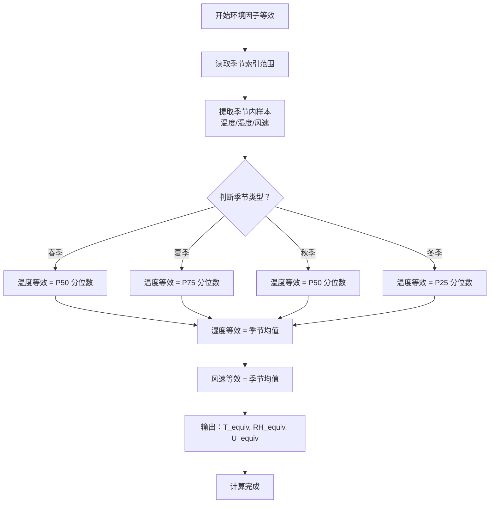
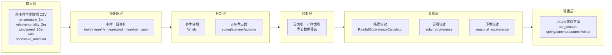
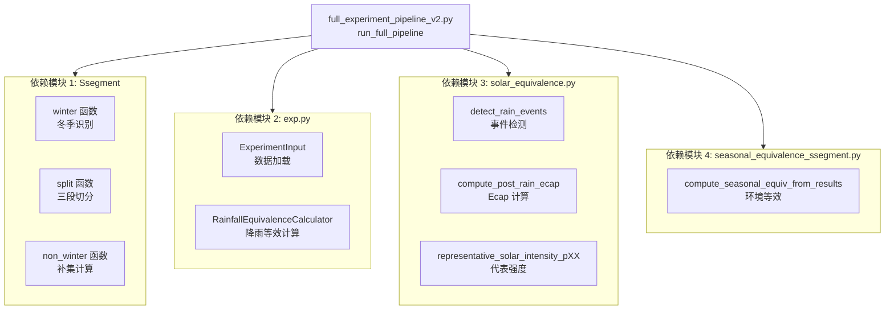
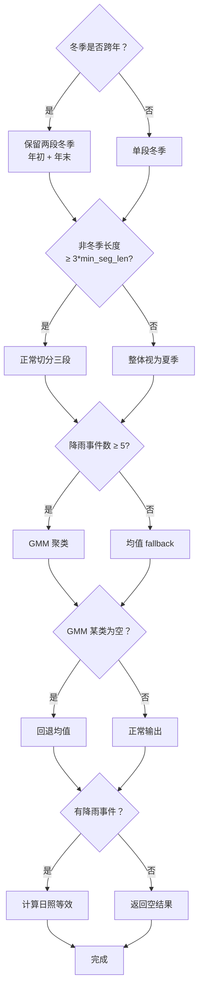
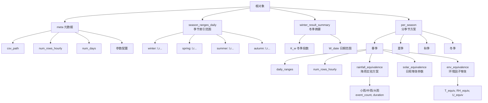

# 气候数据到实验方案转换系统流程图

## 1. 整体系统流程

---

## 2. 季节分割详细流程

---

## 3. split 函数详细流程（τ1/τ2 计算）

---

## 4. 降雨等效计算流程

---

## 5. 日照等效计算流程

---

## 6. 环境因子等效计算流程

---

## 7. 数据流图

---

## 8. 模块调用关系图

---

## 9. 关键决策点

---

## 10. 输出结构图

